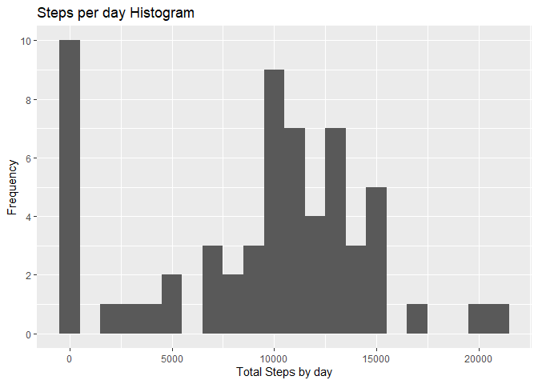
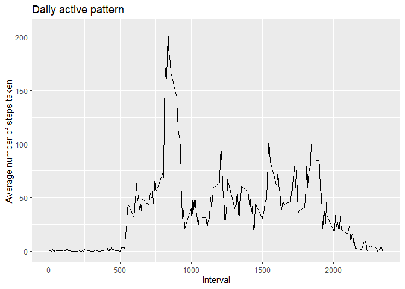
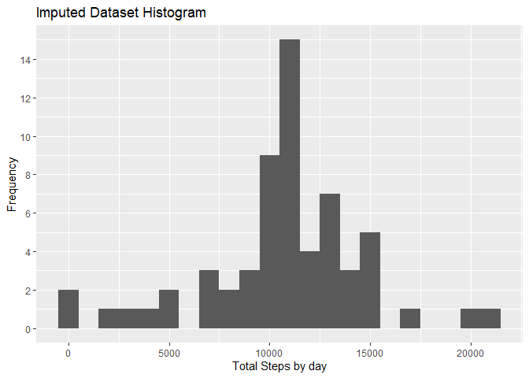
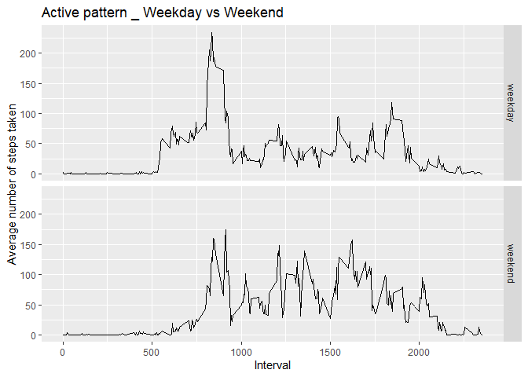

## Loading and preprocessing the data

``` r
        rawData <- read.csv(unzip("activity.zip"))
```
## What is mean total number of steps taken per day

``` r
        library(dplyr)
```

```
## 
## Attaching package: 'dplyr'
```

```
## The following objects are masked from 'package:stats':
## 
##     filter, lag
```

```
## The following objects are masked from 'package:base':
## 
##     intersect, setdiff, setequal, union
```

``` r
        library(ggplot2)
        sum_by_day <- rawData %>%
          group_by(date) %>%
            summarise(steps_taken_by_day = sum(steps, na.rm=TRUE), .groups="drop") %>%
          ungroup()
        mean_steps <- mean(sum_by_day$steps_taken_by_day, na.rm=TRUE)
        median_steps <- median(sum_by_day$steps_taken_by_day, na.rm=TRUE)
        
        sum_by_day
```

```
## # A tibble: 61 × 2
##    date       steps_taken_by_day
##    <chr>                   <int>
##  1 2012-10-01                  0
##  2 2012-10-02                126
##  3 2012-10-03              11352
##  4 2012-10-04              12116
##  5 2012-10-05              13294
##  6 2012-10-06              15420
##  7 2012-10-07              11015
##  8 2012-10-08                  0
##  9 2012-10-09              12811
## 10 2012-10-10               9900
## # ℹ 51 more rows
```

``` r
        ggplot(sum_by_day, aes(x=steps_taken_by_day))+ geom_histogram(binwidth = 1000) + xlab("Total Steps by day") + ylab("Frequency") + scale_y_continuous(breaks = scales::breaks_width(2)) + ggtitle("Steps per day Histogram")
```

<!-- -->

``` r
        mean_steps
```

```
## [1] 9354.23
```

``` r
        median_steps
```

```
## [1] 10395
```
The mean steps is 9354.23 and the median steps is 10395 of the total number of steps taken per day.

## What is the average daily activity pattern?

``` r
        mean_steps_by_interval <- rawData %>%
          group_by(interval) %>%
            summarise(mean_steps = mean(steps, na.rm=TRUE), .groups="drop") %>%
          ungroup()
        ggplot(mean_steps_by_interval, aes(x=interval, y=mean_steps)) + geom_line() + xlab("Interval") + ylab("Average number of steps taken") + ggtitle("Daily active pattern")
```

<!-- -->

``` r
        max_val <- max(mean_steps_by_interval[[2]], na.rm = TRUE)
        max_interval <- mean_steps_by_interval[mean_steps_by_interval[[2]] == max_val,1]
        max_interval
```

```
## # A tibble: 1 × 1
##   interval
##      <int>
## 1      835
```
5-minute interval contains the maximum number is 835.

## Imputing missing values

``` r
        sum(!complete.cases(rawData))
```

```
## [1] 2304
```
The total number of missing values is 2304.
I replaced NA steps with the mean steps calculated for each intervals.

``` r
        rawData_imputed <- rawData %>%
          group_by(interval) %>%
          mutate(
            steps_imputed = if_else(
              is.na(steps), mean(steps, na.rm=TRUE),
              steps
            )
          ) %>%
          ungroup()
        
        sum_by_day_imputed <- summarise(group_by(rawData_imputed,date),steps_taken_by_day_imputed = sum(steps_imputed, na.rm=TRUE), .groups="drop")
        mean_steps_imputed <- mean(sum_by_day_imputed$steps_taken_by_day_imputed, na.rm=TRUE)
        median_steps_imputed <- median(sum_by_day_imputed$steps_taken_by_day_imputed, na.rm=TRUE)
        
        ggplot(sum_by_day_imputed, aes(x=steps_taken_by_day_imputed))+ geom_histogram(binwidth = 1000) + xlab("Total Steps by day") + ylab("Frequency") + scale_y_continuous(breaks = scales::breaks_width(2)) + ggtitle("Imputed Dataset Histogram")
```

<!-- -->

``` r
        mean_steps_imputed
```

```
## [1] 10766.19
```

``` r
        median_steps_imputed
```

```
## [1] 10766.19
```
After imputation, the mean steps is 1.076619 and the median steps is 1.0769.
The imputed mean and median steps are same.

## Are there differences in activity patterns between weekdays and weekends?

``` r
        rawData$date <- as.Date(rawData$date)
        Data_weekday <- rawData %>%
          mutate(
            is_weekday = ifelse(weekdays(date) %in% c("Saturday", "Sunday", "土曜日", "日曜日"), "weekend", "weekday")
          )
        
        mean_steps_by_interval_weekday <- Data_weekday %>%
          group_by(interval,is_weekday) %>%
            summarise(mean_steps = mean(steps, na.rm=TRUE), .groups="drop") %>%
          ungroup()
        
        ggplot(mean_steps_by_interval_weekday, aes(x = interval, y = mean_steps)) + geom_line() + xlab("Interval") + ylab("Average number of steps taken") + facet_grid(is_weekday ~.) + ggtitle("Active pattern _ Weekday vs Weekend")
```

<!-- -->
